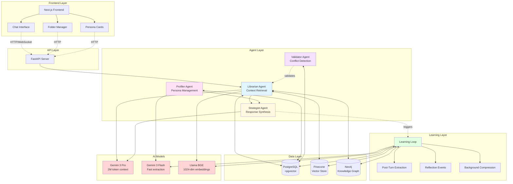
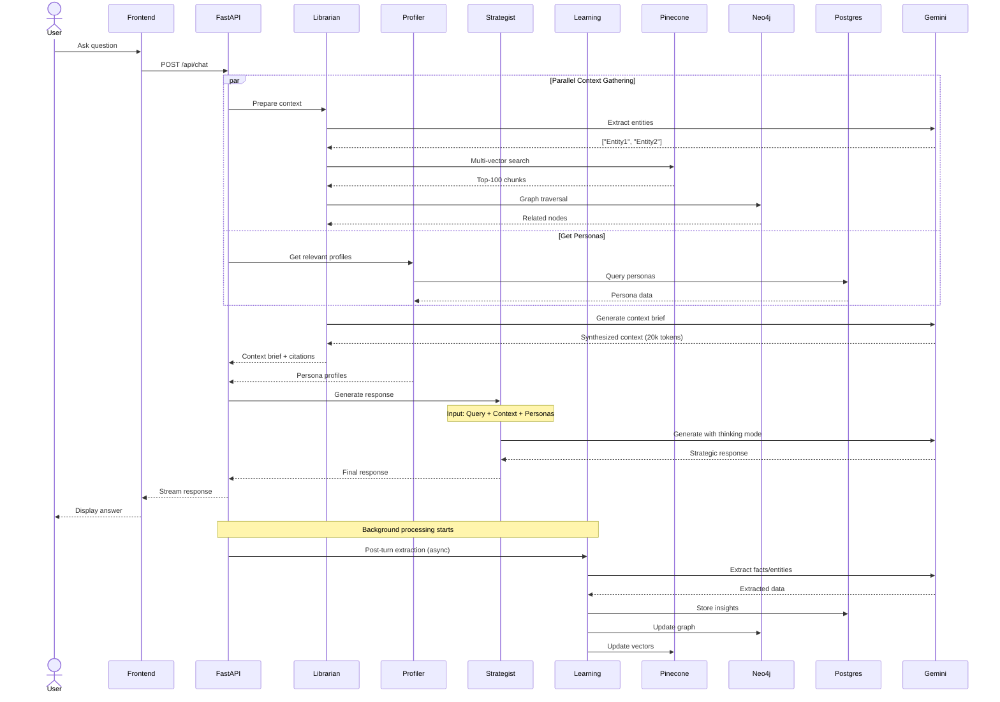
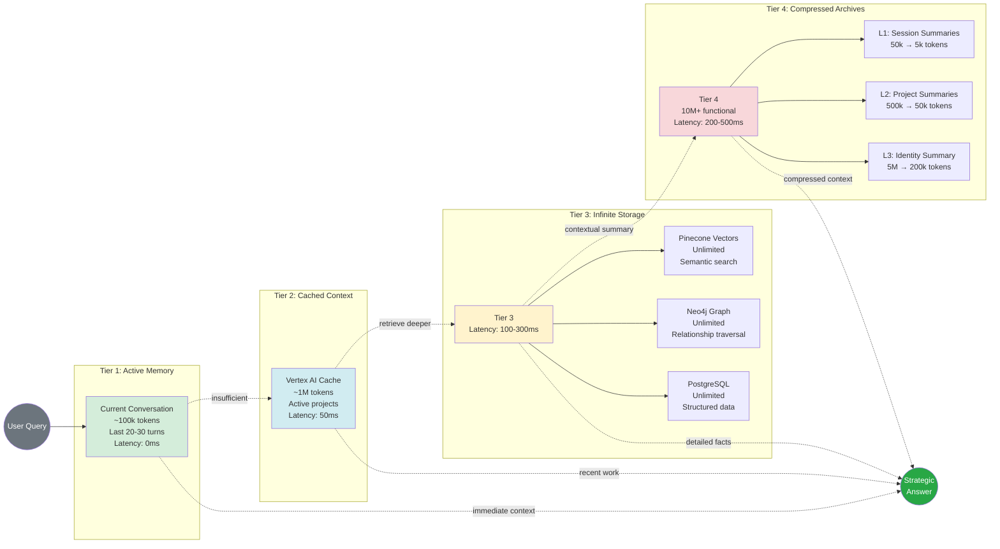
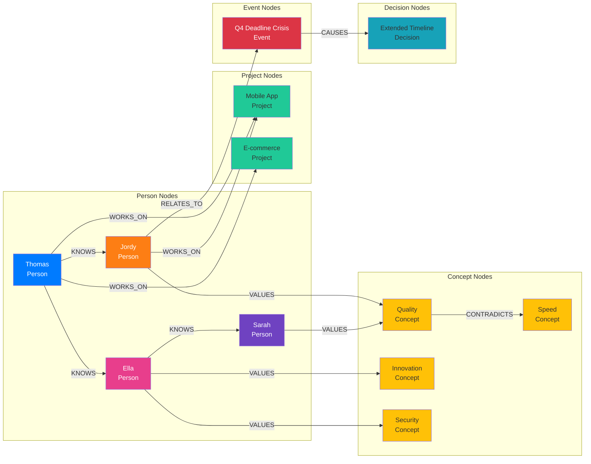
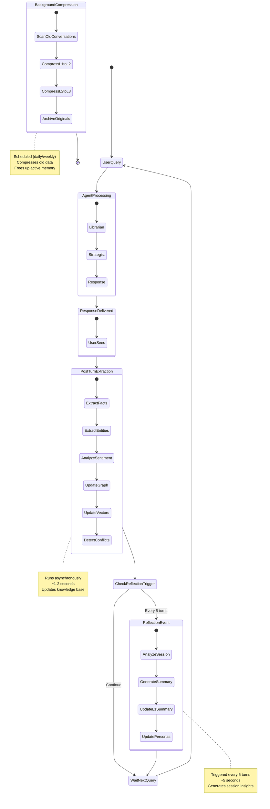
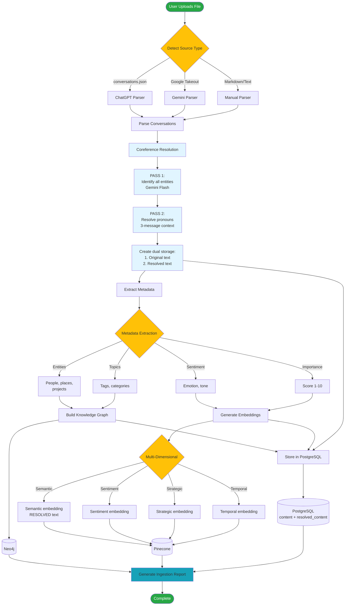
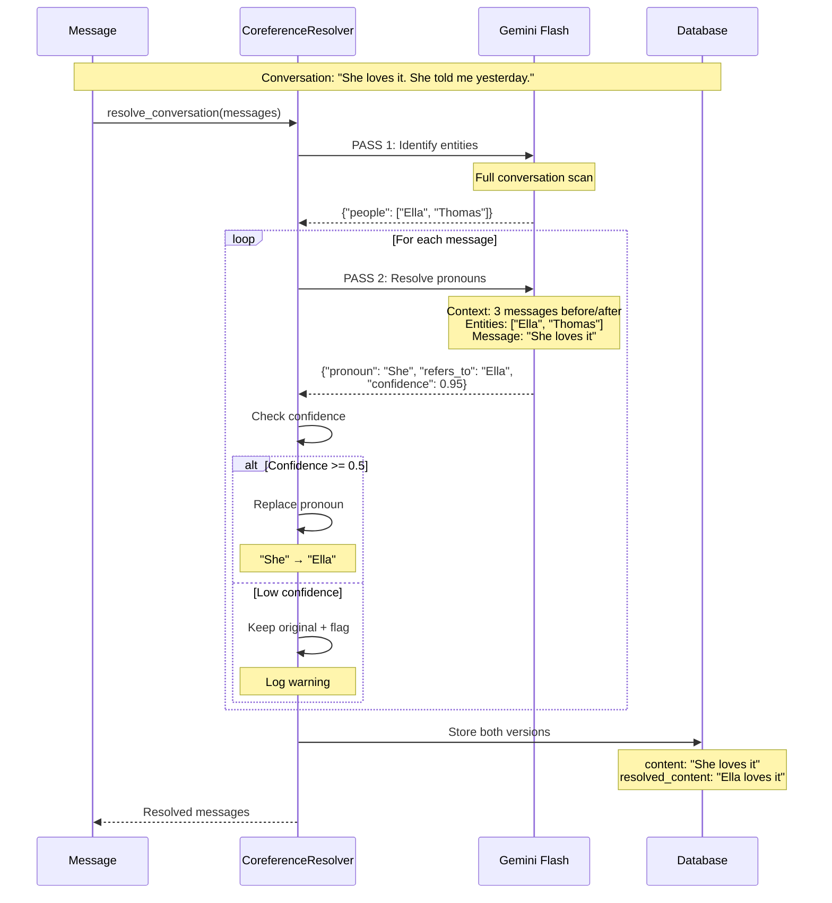
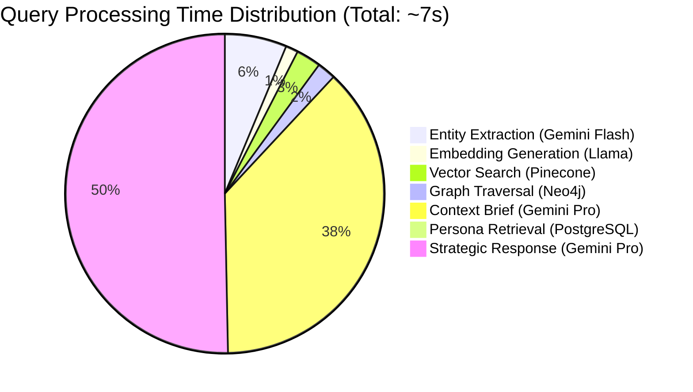

# DeepMemory LLM - Visual Architecture Diagrams

This document contains interactive Mermaid diagrams that visualize the system architecture.

## 1. High-Level System Architecture



## 2. Query Processing Flow



## 3. Memory Hierarchy



## 4. Multi-Dimensional Vector Search

```mermaid
graph TB
    Query[User Query:<br/>"Handle conflict with Jordy"]
    
    subgraph "Embedding Generation"
        E1[Semantic Embedding<br/>Raw query]
        E2[Sentiment Embedding<br/>Emotion + dynamics]
        E3[Strategic Embedding<br/>Goals + decisions]
        E4[Temporal Embedding<br/>Evolution over time]
    end
    
    Query --> E1
    Query --> E2
    Query --> E3
    Query --> E4
    
    subgraph "Pinecone Namespaces"
        NS1[semantic namespace]
        NS2[sentiment namespace]
        NS3[strategic namespace]
        NS4[temporal namespace]
    end
    
    E1 -.1024-dim vector.-> NS1
    E2 -.1024-dim vector.-> NS2
    E3 -.1024-dim vector.-> NS3
    E4 -.1024-dim vector.-> NS4
    
    subgraph "Search Results"
        R1[Top-25 chunks<br/>0.85+ similarity]
        R2[Top-25 chunks<br/>0.82+ similarity]
        R3[Top-25 chunks<br/>0.80+ similarity]
        R4[Top-25 chunks<br/>0.78+ similarity]
    end
    
    NS1 --> R1
    NS2 --> R2
    NS3 --> R3
    NS4 --> R4
    
    Fusion[Reciprocal Rank Fusion<br/>Weight: 0.35, 0.25, 0.25, 0.15]
    R1 --> Fusion
    R2 --> Fusion
    R3 --> Fusion
    R4 --> Fusion
    
    Final[Final Ranked List<br/>Top-100 chunks<br/>~200k tokens]
    Fusion --> Final
    
    style Query fill:#007bff,color:#fff
    style Fusion fill:#ffc107
    style Final fill:#28a745,color:#fff
```

## 5. Knowledge Graph Structure



## 6. Learning Loop Cycle



## 7. Data Ingestion Pipeline



## 7b. Coreference Resolution Detail



## 8. Agent Collaboration Flow

```mermaid
graph TB
    subgraph "Input"
        UserQuery[User Query]
        History[Conversation History]
    end
    
    UserQuery --> Router{Query Router}
    History --> Router
    
    Router -->|Complex query| FullPipeline[Full Agent Pipeline]
    Router -->|Simple query| FastPath[Fast Path<br/>Direct to Gemini]
    
    FastPath --> QuickResponse[Quick Response]
    
    FullPipeline --> Librarian
    
    subgraph Librarian[Librarian Agent]
        L1[Extract entities]
        L2[Vector search:<br/>4 namespaces]
        L3[Graph traversal:<br/>depth=3]
        L4[Hybrid ranking]
        L5[Generate context brief<br/>~20k tokens]
        
        L1 --> L2
        L1 --> L3
        L2 --> L4
        L3 --> L4
        L4 --> L5
    end
    
    L5 --> Validator
    
    subgraph Validator[Validator Agent]
        V1[Check contradictions]
        V2[Flag conflicts]
        V3[Verify sources]
        
        V1 --> V2
        V2 --> V3
    end
    
    V3 --> Profiler
    
    subgraph Profiler[Profiler Agent]
        P1[Identify mentioned people]
        P2[Load persona profiles]
        P3[Enrich with psychology]
        
        P1 --> P2
        P2 --> P3
    end
    
    L5 --> Strategist
    P3 --> Strategist
    
    subgraph Strategist[Strategist Agent]
        S1[Receive:<br/>• Context brief<br/>• Personas<br/>• History]
        S2[Gemini Pro<br/>Thinking Mode: HIGH]
        S3[Synthesize response]
        S4[Add citations]
        S5[Format output]
        
        S1 --> S2
        S2 --> S3
        S3 --> S4
        S4 --> S5
    end
    
    S5 --> Response[Strategic Response<br/>with sources]
    QuickResponse --> Output
    Response --> Output
    
    Output[Output to User]
    
    Response -.trigger.-> Learning
    
    subgraph Learning[Learning Loop - Async]
        Learn1[Extract new facts]
        Learn2[Update personas]
        Learn3[Update graph]
        Learn4[Update vectors]
        Learn5[Check for reflection]
        
        Learn1 --> Learn2
        Learn2 --> Learn3
        Learn3 --> Learn4
        Learn4 --> Learn5
    end
    
    Learn5 -.continuous improvement.-> Database[(Knowledge Base)]
    
    style UserQuery fill:#007bff,color:#fff
    style Router fill:#ffc107
    style Output fill:#28a745,color:#fff
    style Database fill:#6c757d,color:#fff
    style Learning fill:#e1ffe1
```



## 9. Context Window Utilization

```mermaid
gantt
    title Context Window Usage Per Query (Gemini 3 Pro: 2M tokens)
    dateFormat X
    axisFormat %s

    section User Input
    Query + History          :a1, 0, 10000
    
    section Librarian Processing
    Retrieved chunks         :a2, 0, 200000
    Thinking prompt          :a3, 200000, 205000
    Context brief generation :a4, 205000, 215000
    
    section Context Brief Output
    Context brief            :a5, 0, 20000
    
    section Profiler Processing
    Persona query            :a6, 0, 15000
    Profile data             :a7, 15000, 20000
    
    section Strategist Processing
    Full input assembly      :a8, 0, 37500
    Thinking mode            :a9, 37500, 47500
    Response generation      :a10, 47500, 52500
    
    section Final Output
    User response            :a11, 0, 5000
```



## 10. Performance Breakdown



---

## Usage Instructions

1. **Viewing Diagrams**: These Mermaid diagrams can be rendered in:
   - GitHub (automatic rendering)
   - VS Code with [Markdown Preview Mermaid Support](https://marketplace.visualstudio.com/items?itemName=bierner.markdown-mermaid)
   - [Mermaid Live Editor](https://mermaid.live/)

2. **Editing**: Copy any diagram code block to customize for presentations or documentation.

3. **Export**: Use Mermaid Live Editor to export as PNG/SVG for presentations.

## Diagram Summary

- **Diagram 1**: Overall system architecture with all components
- **Diagram 2**: Sequential query processing flow with timing
- **Diagram 3**: Memory hierarchy showing four tiers
- **Diagram 4**: Multi-dimensional vector search strategy
- **Diagram 5**: Knowledge graph structure example
- **Diagram 6**: Learning loop state machine
- **Diagram 7**: Data ingestion pipeline flow
- **Diagram 8**: Agent collaboration and workflow
- **Diagram 9**: Context window utilization chart
- **Diagram 10**: Performance time breakdown

These diagrams complement the detailed analysis in `ARCHITECTURE_ANALYSIS.md`.
